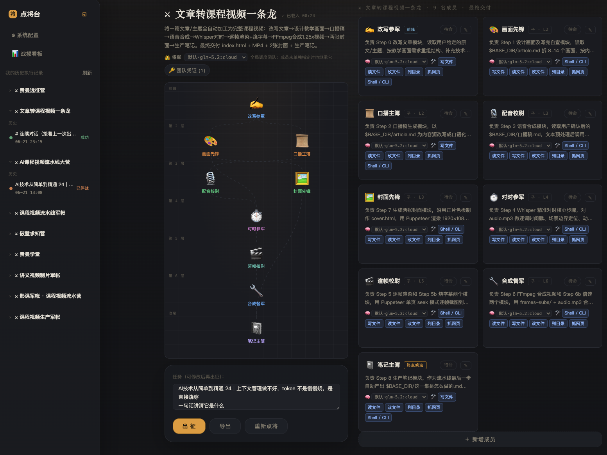

<div align="center">

# ⚔️ 点将台 · AgentTeam Studio

**用一句话，点出一支会自己干活的 AI agent 团队，然后让它们出征。**

[](./LICENSE)
[](https://nodejs.org)
[](#数据与持久化)
[](#开发)

</div>

你给一句话，「军师」帮你把需求想清楚、组建一支分工明确的团队；点「出征」，由「将军」动态调度各「成员」协作，直到产出最终交付物——视频、网页、报告、代码都行。

**它解决的问题**：单个 AI agent 干复杂任务容易"啥都做一半"。点将台把任务拆给一支有层级的团队（前线产出 → 中层聚合 → 收尾整合），每个成员是独立子 agent（独立模型、上下文、记忆、工具），由将军像项目经理一样统筹——更像一个真正会协作的团队，而不是一个全能但分心的个体。

**它的特别之处**：军师、将军、成员三者**跑在同一套 harness 引擎**上（类似 Claude Code 的 agent 循环），递归嵌套。零数据库、零框架——一个 Node.js 进程 + 浏览器直开的前端，`npm start` 就能跑。

<div align="center">



<sub>左侧：历史出征记录　|　中间：将军调度 + 团队 DAG（前线 → 收尾分层）　|　右侧：各成员独立的模型 / 工具 / 实时产出</sub>

</div>

---

## 目录

[特性](#特性) · [快速开始](#快速开始) · [配置](#配置) · [怎么用](#怎么用) · [架构](#架构一图) · [代码结构](#代码结构) · [数据与持久化](#数据与持久化) · [开发](#开发) · [贡献](#贡献) · [许可](#许可)

---

## 特性

- **一句话组队（点将）**：军师先追问关键问题、产出「作战蓝图」，再按蓝图组建 3~8 人团队，分层协作。
- **自主调度（出征）**：将军每轮根据「用户输入 + 各成员产出」决定下一步——派谁、并行、问用户、还是收尾；DAG 只是展示，不是固定顺序。
- **统一 harness 引擎**：军师 / 将军 / 成员共用一套 provider-aware 的 agentic 工具循环（思考 → 调工具 → 回灌 → 迭代）。
- **多模型 / 多 provider**：Anthropic API、本地 Ollama、阿里百炼，以及 Claude Code / Codex CLI。将军与每个成员都可独立选模型。
- **真执行工具**：`shell`、`read_file`、`write_file`、`edit_file`、`list_dir`、`web_fetch`，外加 `ask_user`（人工确认）和 `update_skill`（成员自我进化）。
- **记忆与上下文**：主控记忆与成员私有记忆相互独立，仅在续聊 / 历史再出征时加载；上下文超预算时自动压缩并回写记忆。
- **实时对话 + 停战**：出征中随时给将军或成员发消息；对已完成成员说话会即时并行回应；一键硬终止正在进行的出征。
- **团队自我进化 → 再战**：对话中可改成员契约 / 新建成员 / 追加全局规则；进化过的团队，历史记录再跑就是「⚔ 再战」。
- **富文本交付**：成员输出框直接渲染 Markdown、图片、音视频、`.html` 内联预览、Mermaid 流程图、KaTeX 公式。
- **断点续上**：出征记录持续落盘；服务器重启后自动续上中断的团队。
- **导入 skill 组队**：把一套调试好的 skill（文件 / 文件夹 / 粘贴）丢进来，自动拆成团队成员与依赖图，原文逐字保真。

---

## 快速开始

需要 **Node.js 18+**（用到内置 `fetch` / `AbortController`）。

```bash
git clone https://github.com/wpchao542/team_builder.git
cd team_builder
npm install

cp config.example.json config.json   # 复制配置模板
#   编辑 config.json，至少填一个模型 provider 的凭证（见下表）

npm start                             # 启动 → http://localhost:7860
```

打开 <http://localhost:7860> 即可。**不想配 key、只想看交互**，直接跑演示模式（假数据，不调任何 API）：

```bash
npm run mock                          # MOCK=1 node server.js
```

> 上面每条命令都经实测可直接跑通（含演示模式与 `npm test`）。

---

## 配置

复制 `config.example.json` 为 `config.json` 后按需填写。启动时这些键会注入 `process.env`，shell 工具里可直接用（如 `$ELEVENLABS_API_KEY`）；已存在的系统环境变量优先，不会被覆盖。

| 键 | 说明 |
|---|---|
| `ANTHROPIC_API_KEY` | 用 Anthropic API 时填 |
| `MODEL` | Anthropic 模型，如 `claude-opus-4-8` |
| `OLLAMA_HOST_URL` / `OLLAMA_MODEL` | 用本地 / Ollama 云模型时填，如 `minimax-m3:cloud` |
| `DASHSCOPE_API_KEY` / `BAILIAN_MODEL` | 用阿里百炼时填 |
| `ENABLE_CLAUDE_CODE` / `CLAUDE_BIN` | 用本机 Claude Code CLI（订阅登录）时开 |
| `ENABLE_CODEX_CLI` / `CODEX_BIN` / `CODEX_MODEL` | 用本机 Codex CLI 时开 |
| `DEFAULT_MODEL` | 系统默认模型（界面可改并写回 config.json） |
| `ALLOW_TOOLS` | 真执行总开关，默认开（设 `0` 才关） |
| `TOOL_TIMEOUT_MS` | 单条 shell 命令超时，默认 600000（10 分钟，渲染 / 合成耗时） |

> ⚠️ `config.json` 含密钥，已在 `.gitignore` 里，**不要提交**。业务平台凭证（如某团队要用的 `ELEVENLABS_API_KEY`）由用户在团队上配置、运行时按需注入，**不写死在代码里**。

---

## 怎么用

1. **点将**：首页输入一句话目标（可附带导入的 skill）→ 军师追问 → 产出蓝图 → 组建团队。
2. **点兵**：检查 / 微调成员（角色、模型、工具、依赖），保存团队。
3. **出征**：填任务 → 点「出征」→ 将军开始调度，成员的思考与产出实时显示。
4. **对话**：点开任意将军 / 成员的思考框随时插话；对已完成成员说话即时响应。
5. **停战 / 续聊 / 再战**：随时停战；出征结束后继续对话；进化过 skill 的团队历史项再跑即「再战」。

---

## 架构一图

```
runHarness（唯一引擎：怎么跑）
  ├── 军师（点将）   = harness + [ask_user, submit_blueprint]      → 作战蓝图
  ├── 将军（主控）   = harness + [submit_harness_decision, update_team]
  │                    每轮据「用户输入 + 各成员产出要点」决定 dispatch / 并行 / ask_user / finish
  └── 成员（子agent）= harness + [真执行工具 + ask_user + update_skill] → 交付物
```

- **harness 是动词（怎么跑）**，**agent 是名词（谁在跑）**；三者同引擎、递归嵌套（将军的「工具」就是调成员，成员本身又是一圈 harness）。
- **隔离（仿 Claude Code 子 agent）**：将军和每个成员各有独立上下文 + 独立记忆；将军只看成员的**最终结果要点 + 产物文件路径**，看不到成员内部过程。

完整架构图、嵌套关系、三层 system prompt 原文、关键函数索引见 **[ARCHITECTURE.md](./ARCHITECTURE.md)**。

---

## 代码结构

```
server.js            HTTP 服务 + harness 引擎 + 工具 + 调度（运行时核心）
lib/providers.js     模型 provider 运行时：状态 + 模型注册表 + 各家 IO（anthropic/ollama/百炼/claude-code/codex）
lib/prompts.js       全部系统提示词与 JSON Schema（纯数据）
lib/skills.js        团队配置 / skill 原文 / 蓝图 的归一与拆分（纯函数）
lib/planning.js      将军（Harness 主控）的纯决策层：候选 / 校验 / schema / mock / 思考文案
lib/store.js         持久化与运行存储：团队 / 记忆 / 出征记录（本地 JSON）＋ 内存 runs Map
lib/util.js          通用纯工具（截断、token 用量归一/累加）
lib/constants.js     跨模块共享小常量
public/index.html    前端骨架（结构标记）
public/styles.css    前端样式
public/app.js        前端逻辑（无构建步骤，浏览器直接加载）
test/harness.test.js 纯函数单测
```

> 后端正从单文件渐进式拆分为 `lib/` 模块：先抽出零运行时依赖的「纯数据 / 纯函数 / 持久化」层，运行时核心（providers / harness / orchestrator / 路由）仍在 `server.js`，按「抽一块、跑一遍测试」的方式继续拆。前端也已从单文件 `index.html` 拆成 结构 / 样式 / 逻辑 三个文件。

---

## 数据与持久化

无数据库。本地 JSON 文件 + 内存 Map：

| 数据 | 位置 | 是否入库 |
|---|---|---|
| 团队 | `teams/<id>.json` | ❌ 用户数据 |
| 出征运行记录（spec + 全部事件） | `runs/<runId>/record.json` | ❌ 用户数据 |
| 主控记忆 / 成员私有记忆 | `memory/<teamId>.json` / `memory/<teamId>/members/<id>.json` | ❌ 用户数据 |
| 配置 | `config.json` | ❌ 含密钥 |
| 运行时状态（活跃出征 / 插话队列 / 待确认） | 内存 Map | 进程内，靠 record.json 重启续上 |

---

## 开发

```bash
npm test        # MOCK=1 node --test，跑 test/harness.test.js（纯函数单测，当前 40 项）
npm run mock    # 演示模式，不调真实 API
```

后端核心在 `server.js` + `lib/`（单进程 HTTP 服务，无框架）；前端在 `public/`（无构建步骤，浏览器直接加载）。改动后请保证 `npm test` 全绿、并用 `npm run mock` 跑一遍交互。

---

## 贡献

欢迎 issue 与 PR。提 PR 前请：

1. `npm test` 通过；
2. 不提交任何业务数据或密钥（`config.json` / `teams/` / `runs/` / `memory/` 已在 `.gitignore`）；
3. 大改动尽量沿用现有「纯逻辑进 `lib/`、运行时核心留 `server.js`」的分层。

---

## 致谢

- [@anthropic-ai/sdk](https://github.com/anthropics/anthropic-sdk-typescript) — Anthropic 官方 SDK
- [Mermaid](https://mermaid.js.org/) / [KaTeX](https://katex.org/) — 交付物的图表与公式渲染
- 引擎设计借鉴了 [Claude Code](https://claude.com/claude-code) 的 agent 循环与子 agent 隔离思路

---

## 许可

[MIT](./LICENSE) © wpchao
